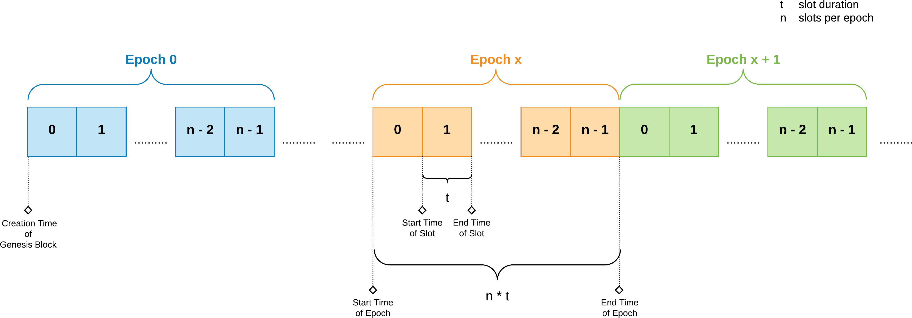

# Time
In Cardano, time is split into epochs and epochs themselves are split into a fixed number `n` of slots. We introduce 
the `PlainSlotDate` and `FullSlotDate` to provide time utilities for Cardano.



## Plain Slot Date
A plain slot date is only determined by its epoch and slot. 
```go
type PlainSlotDate struct {
    epoch *big.Int
    slot  *big.Int
}
```

A plain date is missing further information about the time
settings of the Cardano blockchain. Thus, you can check whether a slot date is equal to another, or lies before and
after it, but you cannot compute information such as the start and end time of a slot date. You need to know the number
of slots in an epoch and the duration of a slot to compute the later. However, you can transform a `PlainSlotDate`
easily into a `FullSlotDate` by passing the `Timesetting` of the corresponding blockchain.

### Functions
* GetEpoch() ... get epoch number of slot date
* GetSlot()  ... get slot number of slot date
* SameAs()   ... check whether two slot dates are equal.
* After()    ... check whether a slot date is strictly after a given one.
* Before()   ... check whether a slot date is strictly before a give one.

### JSON 
The `PlainSlotDate` implements the interface for JSON marshalling and unmarshalling. It expects the 
slot date to be in the format `<EPOCH>.<SLOT>`. Hence, you can use this type when serializing JSON data, e.g. this
response from a call to the REST API of [Jörmungandr](https://github.com/input-output-hk/jormungandr):

```go
type NodeStatistic struct {
    UpTime               uint32                 `json:"uptime"`
    LastBlockDate        *cardano.PlainSlotDate `json:"lastBlockDate"`
    LastBlockFees        *big.Int               `json:"lastBlockFees"`
    LastBlockHash        string                 `json:"lastBlockHash"`
    ...
}
``` 

## Time Setting
For providing a wide range of time utilities, the following specifications of a Cardano blockchain are of importance.
The **creation time of the genesis block** marks the start date of the first slot in which the first block has been minted,
and it is the beginning of computation of time in this specific Cardano blockchain. Next, we need to know the duration
of an epoch, which is given by the **fixed number of slots per epoch** and the **duration of a slot**. With these three
details, we can get a wide range of time utilities.

```go
type TimeSettings struct {
    GenesisBlockDateTime time.Time
    SlotsPerEpoch        *big.Int
    SlotDuration         time.Duration
}
```

## Full Slot Date
A full slot data contains information of the plain slot date including the epoch and slot number together with
the time settings of the blockchain.

### Functions

* Diff()              ... compute the number of slots between two slot dates.
* GetStartDateTime()  ... get the start time of a slot date.
* GetEndDateTime()    ... get the end time of a slot date.